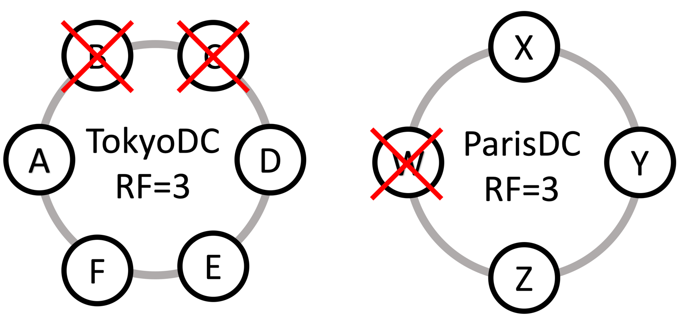
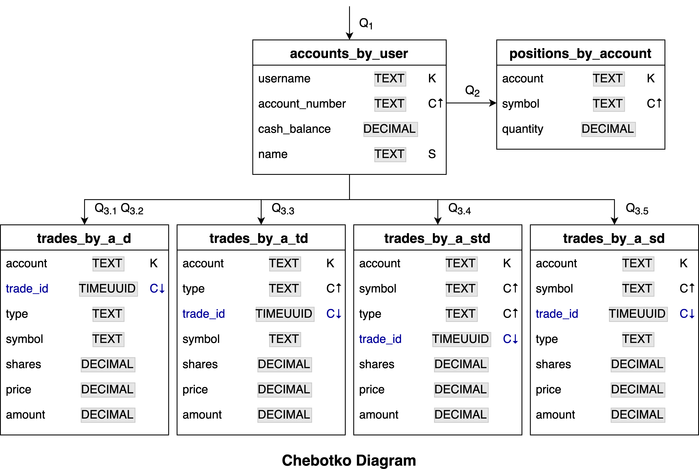

## 🎓🔥 Apache Cassandra™ Certification Workshop 🔥🎓

[](http://www.apache.org/licenses/LICENSE-2.0)
[](https://discord.com/widget?id=685554030159593522&theme=dark)

This section will run you through a set of practice exam questions. We will split them into a set from DS201 (Developer), DS220 (Data Modeling), and DS210 (Administrator). 

## Sample Questions

| Question/Topic | Exam(s)
|---|---|
| **[1. CQL](#1-cql---developer-and-administrator-exams)** | Developer and Administrator |
| **[2. CQL](#2-cql---developer-and-administrator-exams)** | Developer and Administrator |
| **[3. CQL](#3-cql---developer-and-administrator-exams)** | Developer and Administrator |
| **[4. CQL](#4-cql---developer-and-administrator-exams)** | Developer and Administrator |
| **[5. CQL](#5-cql---developer-and-administrator-exams)** | Developer and Administrator |
| **[6. CQL](#6-cql---developer-and-administrator-exams)** | Developer and Administrator |
| **[7. CQL](#7-cql---developer-and-administrator-exams)** | Developer and Administrator |
| **[8. CQL](#8-cql---developer-and-administrator-exams)** | Developer and Administrator |
| **[9. CQL](#9-cql---developer-and-administrator-exams)** | Developer and Administrator |
| **[10. CQL](#10-cql---developer-and-administrator-exams)** | Developer and Administrator |
| **[11. Architecture](#11-architecture---developer-and-administrator-exams)** | Developer and Administrator |
| **[12. Architecture](#12-architecture---developer-and-administrator-exams)** | Developer and Administrator |
| **[13. Architecture](#13-architecture---developer-and-administrator-exams)** | Developer and Administrator |
| **[14. Configuration](#14-configuration---administrator-exam)** | Administrator |
| **[15. Configuration](#15-configuration---administrator-exam)** | Administrator |
| **[16. Read/Write/Storage](#16-readwritestorage---administrator-exam)** | Administrator |
| **[17. Read/Write/Storage](#17-readwritestorage---administrator-exam)** | Administrator |
| **[18. Read/Write/Storage](#18-readwritestorage---administrator-exam)** | Administrator |
| **[19. Data Modeling](#19-data-modeling---developer-exam)** | Developer |
| **[20. Data Modeling](#20-data-modeling---developer-exam)** | Developer |

### 1. CQL - Developer and Administrator Exams
Consider the CQL statements:
```
CREATE TABLE roller_coasters (
    name TEXT,
    park TEXT,
    rating INT,
    PRIMARY KEY((name))
);

INSERT INTO roller_coasters (name, park, rating) 
  VALUES ('Millenium Force', 'Cedar Point', 8 );

INSERT INTO roller_coasters (name, park, rating) 
  VALUES ('Formula Rossa', 'Ferrari World', 9 );

INSERT INTO roller_coasters (name, park, rating) 
  VALUES ('Steel Dragon 2000', 'Nagashima Spa Land', 10 );

INSERT INTO roller_coasters (name, park, rating) 
  VALUES ('Millenium Force', 'Cedar Point', 7 );
```

How many rows will the ``roller_coasters`` table have after executing all the CQL statements?

**A.** none

**B.** 2

**C.** 3

**D.** 4

<details><summary>Click to view the correct answer</summary>
<p>

| The correct answer is C |
| :--- |
| The first and fourth ``INSERTS`` use the same primary key so they cause an *upsert*. Therefore only 3 rows are created. |
</p>
</details>

[⬆️ Top](#sample-questions)

### 2. CQL - Developer and Administrator Exams
Consider the CQL statements:
```
CREATE TABLE songs (
    artist TEXT,
    title TEXT,
    length_seconds INT,
    PRIMARY KEY((artist, title))
);

INSERT INTO songs (artist, title, length_seconds) 
  VALUES ('The Beatles', 'Yesterday', 123 );

INSERT INTO songs (artist, title, length_seconds) 
  VALUES ('The Beatles', 'Let It Be', 243 );

INSERT INTO songs (artist, title, length_seconds) 
  VALUES ('Abba', 'Fernando', 255 );

INSERT INTO songs (artist, title, length_seconds) 
  VALUES ('Frank Sinatra', 'Yesterday', 235 );
```

What is the result of executing all the CQL statements?

**A.** A table with 1 partition. 

**B.** A table with 2 partitions.

**C.** A table with 3 partitions.

**D.** A table with 4 partitions.

<details><summary>Click to view the correct answer</summary>
<p>

| The correct answer is D |
| :--- |
| The primary key consists of ``artist`` *and* ``title``. Each ``INSERT`` has a unique ``artist``/``title`` pair so there are no *upserts* and each ``INSERT`` results in a unique partition. |
</p>
</details>

[⬆️ Top](#sample-questions)

### 3. CQL - Developer and Administrator Exams
Consider the CQL statement:
```
CREATE TABLE cars (
    make TEXT,
    model TEXT,
    year INT,
    color TEXT,
    cost INT,
    PRIMARY KEY ((make, model), year, color)
);
```

Which of the following is a valid query for the cars table?

**A.** 
```
SELECT * FROM cars 
  WHERE make='Ford';
```

**B.** 
```
SELECT * FROM cars 
  WHERE year = 1969 
  AND color = 'Red';
```

**C.** 
```
SELECT * FROM cars 
  WHERE make='Ford' 
  AND model = 'Mustang' 
  AND year = 1969;
```

**D.** 
```
SELECT * FROM cars 
  WHERE make='Ford' 
  AND model = 'Mustang' 
  AND color = 'Red';
```

<details><summary>Click to view the correct answer</summary>
<p>

| The correct answer is C |
| :--- |
| The partition key consists of ``make`` *and* ``model`` so **A** and **B** are excluded because the ``WHERE`` clause does not include the partition key. **C** and **D** both include the partition key but clustering columns can only be *constrained* L-R in the order they appear in the primary key. Since ``year`` appears before ``color``, **C** is correct and **D** is excluded. |
</p>
</details>

[⬆️ Top](#sample-questions)

### 4. CQL - Developer and Administrator Exams
Consider the CQL statements:
```
CREATE TABLE employees (
    id TEXT,
    name TEXT,
    department TEXT,
    PRIMARY KEY ((id))
);

CREATE TABLE employees_by_department (
    id TEXT,
    name TEXT,
    department TEXT,
    PRIMARY KEY ((department), id)
);

BEGIN BATCH
    INSERT INTO employees (id, name, department) 
      VALUES ('AC1123', 'Joe', 'legal');

    INSERT INTO employees_by_department (id, name, department)
      VALUES ('AC1123', 'Joe', 'legal');
APPLY BATCH;
```
What is a valid statement about this atomic batch?

**A.** It is a single-partition batch that can be applied.

**B.** It is a single-partition batch that cannot be applied.

**C.** It is a multi-partition batch that can be applied.

**D.** It is a multi-partition batch that cannot be applied.

<details><summary>Click to view the correct answer</summary>
<p>

| The correct answer is C |
| :--- |
| The two ``INSERTS`` are into different tables which makes them different partitions. Even if one or both result in *upserts* there is nothing preventing this batch from being applied. |
</p>
</details>

[⬆️ Top](#sample-questions)

### 5. CQL - Developer and Administrator Exams
Consider the table definition with a primary key omitted:
```
CREATE TABLE reviews_by_restaurant (
    name TEXT,
    city TEXT,
    reviewer TEXT,
    rating INT,
    comments TEXT,
    review_date TIMEUUID,
    PRIMARY KEY (...)
)
```
It is known that:
- Restaurant Reviews are uniquely identified by a combination of ``name``, ``city`` and ``reviewer``
- Restaurant Reviews are retrieved from the table using combination of ``name``, ``city``
- The table has multi-row partitions

What primary key does this table have?

**A.** 
```PRIMARY KEY((name), reviewer, city)```

**B.** 
```PRIMARY KEY((name, city), reviewer)```

**C.** 
```PRIMARY KEY((name, reviewer), city)```

**D.** 
```PRIMARY KEY(reviewer, name city)```

<details><summary>Click to view the correct answer</summary>
<p>

| The correct answer is B |
| :--- |
| Since restaurant reviews are uniquely identified by a combination of ``name``, ``city`` and ``reviewer`` the primary key must include all three fields. Since restaurant reviews are retrieved from the table using combination of ``name``, ``city``, these two fields must comprise the *partition key*. Since this table has multi-row partitions and ``reviewer`` is part of the primary key, it must be a clustering column.|
</p>
</details>

[⬆️ Top](#sample-questions)

### 6. CQL - Developer and Administrator Exams
Consider the table definition and the CQL query:
```
CREATE TABLE teams (
    name TEXT PRIMARY KEY,
    wins INT,
    losses INT,
    ties INT
);

SELECT * FROM teams_by_wins WHERE wins = 4;
```
Which materialized view definition can be used to support the query?

**A.** 
```
CREATE MATERIALIZED VIEW IF NOT EXISTS
    teams_by_wins AS
    SELECT * FROM teams
      PRIMARY KEY((name), wins);
```
**B.**
```
CREATE MATERIALIZED VIEW IF NOT EXISTS
    teams_by_wins AS
    SELECT * FROM teams
      PRIMARY KEY((wins), name);
```
**C.**

```
CREATE MATERIALIZED VIEW IF NOT EXISTS
    teams_by_wins AS
    SELECT * FROM teams
      WHERE name IS NOT NULL AND wins IS NOT NULL
      PRIMARY KEY((name), wins);
```
**D.**
```
CREATE MATERIALIZED VIEW IF NOT EXISTS
    teams_by_wins AS
    SELECT * FROM teams
      WHERE wins IS NOT NULL AND name IS NOT NULL
      PRIMARY KEY((wins), name);
```

<details><summary>Click to view the correct answer</summary>
<p>

| The correct answer is D |
|:---|
| Since primary key fields cannot be NULL the ``WHERE`` clause must include a *NULL check*. Since the ``WHERE`` clause in the ``SELECT`` is based on ``wins``, ``wins`` must be the partition key. |
</p>
</details>

[⬆️ Top](#sample-questions)

### 7. CQL - Developer and Administrator Exams
Consider the table definition and the CQL query:
```
CREATE TABLE restaurants_by_city (
    name TEXT,
    city TEXT,
    cuisine TEXT,
    price int,
    PRIMARY KEY ((city), name)
);

SELECT * FROM restaurants_by_city
  WHERE city = 'Sydney'
  AND cuisine = 'sushi';
```  
Which secondary index can be used to support the query?

**A.** 
```
CREATE INDEX cuisine_restaurants_by_city_2i
  ON restaurants_by_city (cuisine);
```
**B.**

```
CREATE INDEX cuisine_restaurants_by_city_2i
  ON restaurants_by_city (city, cuisine);
```
**C.**

```
CREATE INDEX cuisine_restaurants_by_city_2i
  ON restaurants_by_city (cuisine, city);
```
**D.**

```
CREATE INDEX cuisine_restaurants_by_city_2i
  ON restaurants_by_city (city, name, cuisine);
```
<details><summary>Click to view the correct answer</summary>
<p>

| The correct answer is A |
|:---|
| B, C, and D are incorrect because indexes on multiple columns are not supported. |
</p>
</details>

[⬆️ Top](#sample-questions)

### 8. CQL - Developer and Administrator Exams
Which statement describes the ``WHERE`` clause in a query?

**A.** ``WHERE`` clauses must reference all the fields of the partition key.

**B.** ``WHERE`` clauses must reference all the fields of the clustering key.

**C.** ``WHERE`` clauses must reference all the fields of the primary key.

**D.** ``WHERE`` clauses must reference all the fields of the partition key and clustering key.

<details><summary>Click to view the correct answer</summary>
<p>

| The correct answer is A |
|:---|
| Only the fields of the partition key are required. |
</p>
</details>

[⬆️ Top](#sample-questions)

### 9. CQL - Developer and Administrator Exams
Consider the CQL statements:
```
CREATE TYPE NAME (
    first TEXT,
    last TEXT
);

CREATE TABLE people (
    id UUID,
    name NAME,
    email TEXT,
    PRIMARY KEY(id, email)
);
```
Which ``INSERT`` statement can be used to insert a row in the ``people`` table?

**A.**
```
INSERT INTO people (id, name, email) 
  VALUES (UUID(), {first:'foo', last:'bar'}, 'foo@datastax.com' );
```
**B.**
```
INSERT INTO people (id, name, email) 
  VALUES (UUID(), name: {'foo', 'bar'}, 'foo@datastax.com' );
```
**C.**
```
INSERT INTO people (id, name, email) 
  VALUES (UUID(), 'foo', 'bar', 'foo@datastax.com' );
```
**D.**
```
INSERT INTO people (id, name, email) 
  VALUES (UUID(), ('foo', 'bar), 'foo@datastax.com' );
```
<details><summary>Click to view the correct answer</summary>
<p>
    
| The correct answer is A |
|:---|
| The fields of the user defined type are passed using JSON. |
</p>
</details>

[⬆️ Top](#sample-questions)

### 10. CQL - Developer and Administrator Exams
Consider the CQL statements:
```
CREATE TABLE emails_by_user (
    username TEXT,
    email TEXT,
    description TEXT,
    nickname TEXT STATIC,
    PRIMARY KEY((username), email)
);

INSERT INTO people (username, email, description, nickname) 
  VALUES ('dc1234', 'david@datastax.com', 'work', 'Dave');
  
INSERT INTO people (username, email, description, nickname) 
  VALUES ('dc1234', 'david@gmail.com', 'personal', 'Dave');
  
UPDATE people SET nickname = 'Davey', description = 'school' 
  WHERE username = 'dc1234' AND email = 'david@gmail.com';
  
SELECT * FROM PEOPLE WHERE username = 'dc1234';  
```
What is the result of executing these CQL statements?

**A.**
```
 username  | email              | nickname | description
-----------+--------------------+----------+-------------
    dc1234 | david@datastax.com |     Dave |        work
    dc1234 |    david@gmail.com |    Davey |      school
```
**B.**
```
 username  | email              | nickname | description
-----------+--------------------+----------+-------------
    dc1234 | david@datastax.com |    Davey |        work
    dc1234 |    david@gmail.com |    Davey |      school
```

**C.**
```
 username  | email              | nickname | description
-----------+--------------------+----------+-------------
    dc1234 |    david@gmail.com |    Davey |      school
```

**D.**
```
 username  | email              | nickname | description
-----------+--------------------+----------+-------------
    dc1234 | david@datastax.com |     Dave |        work
```
<details><summary>Click to view the correct answer</summary>
<p>

| The correct answer is B |
|:---|
| The ``nickname`` field is static so both rows were set to *Davey*. Because ``email`` is a clustering column the table has two partitions. |
</p>
</details>

[⬆️ Top](#sample-questions)

### 11. Architecture - Developer and Administrator Exams
Consider the two datacenters in the diagram. ``TokyoDC`` has six nodes (two *failed* and four *active*) and a replication factor of 3, and ``ParisDC`` four nodes (one *failed* and three *active*) and a replication factor of 3.



What is a valid statement about a read request made at consistency level of ``LOCAL QUORUM`` to coordinator node ``Z`` in ``ParisDC``?

**A.** The request will be handled in data center ``ParisDC`` and will fail.

**B.** The request will be handled in data center ``ParisDC`` and will succeed.

**C.** The request will be retried in data center ``TokyoDC`` and will fail.

**D.** The request will be retried in data center ``TokyoDC`` and will succeed.

<details><summary>Click to view the correct answer</summary>
<p>
    
| The correct answer is B |
|:---|
| ``LOCAL QUORUM`` requires a quorum (more than half) of the replicas in the *local data center* to respond in order to succeed. Since only 1 of 4 nodes in ``ParisDC`` have failed there will be at least 2 replicas available to handle the request. 2 is the quorum of 3, therefore the request will succeed. |
</p>
</details>

[⬆️ Top](#sample-questions)

### 12. Architecture - Developer and Administrator Exams
Consider these CQL traces:

```
 activity                                                                     | timestamp                  | source       | source_elapsed | client
------------------------------------------------------------------------------+----------------------------+--------------+----------------+--------------
                                                           Execute CQL3 query | 2020-10-09 16:18:49.223000 | 10.52.26.153 |              0 | 10.52.13.186
 Parsing INSERT INTO NAMES (id, name) VALUES (UUID(), 'Dave'); [CoreThread-0] | 2020-10-09 16:18:49.223000 | 10.52.26.153 |            328 | 10.52.13.186
                                           Preparing statement [CoreThread-0] | 2020-10-09 16:18:49.223000 | 10.52.26.153 |            690 | 10.52.13.186
                             Determining replicas for mutation [CoreThread-0] | 2020-10-09 16:18:49.224000 | 10.52.26.153 |           1834 | 10.52.13.186
                                        Appending to commitlog [CoreThread-0] | 2020-10-09 16:18:49.225000 | 10.52.26.153 |           2193 | 10.52.13.186
                                      Adding to names memtable [CoreThread-0] | 2020-10-09 16:18:49.225000 | 10.52.26.153 |           2326 | 10.52.13.186
                                                             Request complete | 2020-10-09 16:18:49.225966 | 10.52.26.153 |           2966 | 10.52.13.186
```
At what elapsed time is the data persisted so that it will survive an unexpected node shutdown?

**A.** 690 milliseconds
 
**B.** 1834 milliseconds

**C.** 2193 milliseconds

**D.** 2966 milliseconds

<details><summary>Click to view the correct answer</summary>
<p>
    
| The correct answer is C |
|:---|
| Once data is written to *commit log* it will survive an unexpected node shutdown. |
</p>
</details>

[⬆️ Top](#sample-questions)

### 13. Architecture - Developer and Administrator Exams
How is Replication Factor configured in Cassandra?

**A.** per cluster

**B.** per keyspace

**C.** per operation

**D.** per node

<details><summary>Click to view the correct answer</summary>
<p>
    
| The correct answer is B |
|:---|
| Replication factor (and strategy) *must* be configured when creating a keyspace. |
</p>
</details>

[⬆️ Top](#sample-questions)

### 14. Configuration - Administrator Exam
What are two options for ``internode_encryption`` in Cassandra? (Choose two.)

**A.** ``client``

**B.** ``node``

**C.** ``rack``

**D.** ``enabled``

**E.** ``dc``

<details><summary>Click to view the correct answers</summary>
<p>
    
| The correct answers are C and E |
|:---|
| The available options are: ``all``, ``none``, ``dc`` and ``rack``. |
</p>
</details>

[⬆️ Top](#sample-questions)

### 15. Configuration - Administrator Exam
Which configuration file is used to set garbage collection properties for Cassandra?

**A.** ``cassandra.yaml``

**B.** ``jvm.options``

**C.** ``cassandra-env.sh``

**D.** ``gc.options``

<details><summary>Click to view the correct answer</summary>
<p>
    
| The correct answer is B |
|:---|
| The purpose of the ``jvm.options`` file is to put JVM-specific properties (like garbage collection) in one place. |
</p>
</details>

[⬆️ Top](#sample-questions)

### 16. Read/Write/Storage - Administrator Exam
Consider the table definition and how a single row is stored in one Memtable two SSTables on a Cassandra node:

```
CREATE TABLE tests(
    id INT PRIMARY KEY,
    test TEXT,
    score int
);
```
**Memtable**
```
id: 11 timestamp: 1392353211
score: 75 timestamp: 1392353211
```                   
**SSTable**
```
id: 11 timestamp: 1204596828
test: math timestamp: 1204596828
score: 62 timestamp: 1204596828
```                  
**SSTable**
```
id: 11 timestamp: 1183608357
test: english timestamp: 1183608357
score: 48 timestamp: 1183608357
```

What are the current values for this row?

**A.**
```
 id | test    | score
----+---------+-------
 11 | english |    48
```
**B.**
```
 id | test | score
----+------+-------
 11 | math |    75
```
**C.**
```
 id | test | score
----+------+-------
 11 | math |    62
```
**D.**
```
 id | test | score
----+------+-------
 11 | math |    48
```

<details><summary>Click to view the correct answer</summary>
<p>
    
| The correct answer is B |
|:---|
| Data for a row may be spread across the memtable and multiple SSTables. The row value is made up of the most recent (timestamp) value for each column. |
</p>
</details>

[⬆️ Top](#sample-questions)

### 17. Read/Write/Storage - Administrator Exam
What is a valid statement about a coordinator node handling a query at consistency level ``THREE``?

**A.** The coordinator node sends a direct read request to all replicas.

**B.** The coordinator node sends a direct read request to three replicas.

**C.** The coordinator node sends a background read repair request to three replicas.

**D.** The coordinator node sends a direct read request to one replica and digest requests to two replicas.

<details><summary>Click to view the correct answer</summary>
<p>
    
| The correct answer is D |
|:---|
| The coordinator node only sends a *direct read* request to one node and sends *digest* request(s) to the remainder necessary to meet the consistency level. The coordinator node then compares the data read directly with the digest(s). If they agree the result is returned to the client. If they do not agree the most recent timestamped result is considered current and sent to the client. The coordinator node may need to request the latest timestamped version from a replica. |
</p>
</details>

[⬆️ Top](#sample-questions)

### 18. Read/Write/Storage - Administrator Exam
What is a valid statement about a write made at consistency level ``LOCAL_QUORUM`` against a keyspace with replication factor of ``3``?

**A.** The coordinator node will send a write to one node.

**B.** The coordinator node will send writes to two nodes.

**C.** The coordinator node will send writes to three nodes.

**D.** The coordinator node will send writes to all nodes.

<details><summary>Click to view the correct answer</summary>
<p>
    
| The correct answer is C |
|:---|
| The coordinator node will always attempt to write to the number of nodes specified in the replication factor. |
</p>
</details>

[⬆️ Top](#sample-questions)

### 19. Data Modeling - Developer Exam
Consider the Chebotko Diagram that captures the physical data model for investment portfolio data:



What is the primary key and clustering order of the table ``trades_by_a_std``?

**A.** 
```
    PRIMARY KEY((account), trade_id, symbol, type)
)
WITH CLUSTERING ORDER BY (trade_id DESC, symbol ASC, type ASC);
```

**B.** 
```
    PRIMARY KEY((account), trade_id, symbol, type)
)
WITH CLUSTERING ORDER BY (trade_id DESC);
```

**C.** 
```
    PRIMARY KEY((account),symbol, type, trade_id)
)
WITH CLUSTERING ORDER BY (trade_id DESC);
```

**D.** 
```
    PRIMARY KEY((account),symbol, type, trade_id)
)
WITH CLUSTERING ORDER BY (symbol ASC, type ASC, trade_id DESC);
```

<details><summary>Click to view the correct answer</summary>
<p>
    
| The correct answer is D |
|:---|
| In Chebotko Diagrams, a table lists clustering key columns in the order they appear in the primary key. If the clustering order is explicitly specified for a column in the ``WITH CLUSTERING ORDER BY`` clause, the clustering order for all preceding clustering key columns must also be explicitly specified. |
</p>
</details>


[⬆️ Top](#sample-questions)

### 20. Data Modeling - Developer Exam
Consider the Application Workflow Diagram for an investment portfolio application:


Which access pattern(s) are evaluated before an application can evaluate access pattern Q3.2?

**A.** Q<sub>1</sub>

**B.** Q<sub>1</sub> and Q<sub>2</sub>

**C.** Q<sub>1</sub> and Q<sub>3</sub>

**D.** Q<sub>1</sub>, Q<sub>3</sub> and Q<sub>3.1</sub>

<details><summary>Click to view the correct answer</summary>
<p>
    
| The correct answer is A |
|:---|
| Q<sub>1</sub> is the entry point. After Q<sub>1</sub>, Q<sub>2</sub> **or** Q<sub>3</sub> may be evaluated. Q<sub>3</sub> is broken down into Q<sub>3.1</sub> - Q<sub>3.5</sub>. The only prerequisite for Q<sub>3.1</sub> - Q<sub>3.5</sub> is Q<sub>1</sub>. Therefore, only Q<sub>1</sub> must be evaluated before  Q<sub>3.2</sub> |
</p>
</details>

[⬆️ Top](#sample-questions)
